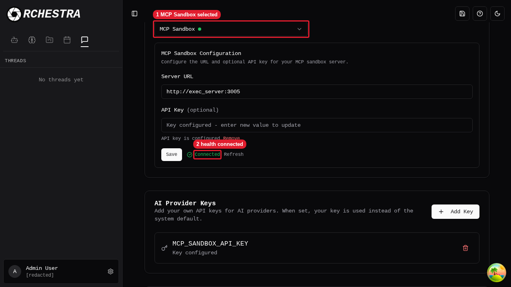
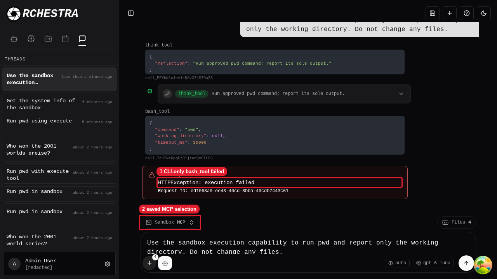
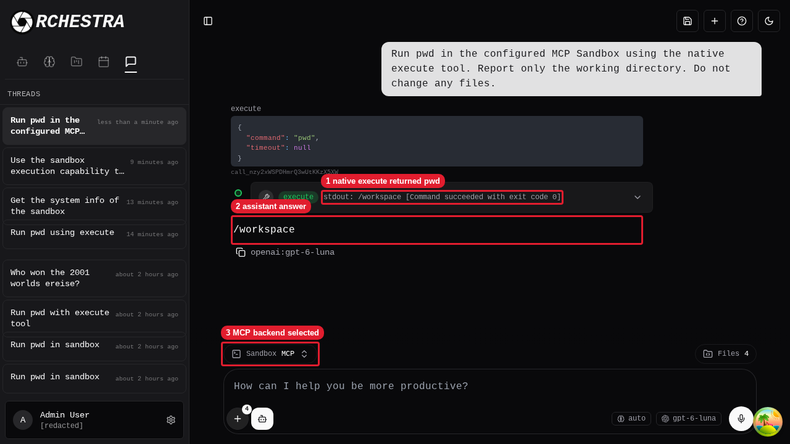

# MCP Sandbox browser review

Review date: 2026-09-28. Run inside the sandbox. Keep the Orchestra backend on port 8000 and the frontend on port 5173. Run Aegra in the named tmux session `orchestra-aegra-operator` on port 2026. Sign in with the existing test account. Do not print tokens or the saved MCP API key.

## A. Saved sandbox configuration

1. Open Settings. Expected: Default Sandbox shows “MCP Sandbox”. The saved server URL is `http://exec_server:3005`. The saved API key indicator shows “Key configured”. The health indicator shows “Connected”.

   

   Callouts: 1 is MCP Sandbox selected. 2 is health connected.

## B. Reproduced new-thread failure

1. Open `/chat`.
2. Enter `Use the sandbox execution capability to run pwd and report only the working directory. Do not change any files.`
3. Submit the message. Before the fix, the new thread invokes `bash_tool` and displays “HTTPException: execution failed”. The backend reports that `bash_tool` runs on the CLI side only. The browser retains the draft. Keep the task-owned failure thread for comparison.

   

   Callouts: 1 is the CLI-only bash tool failure. 2 is the saved MCP selection.

4. Initialize MCP through the authenticated Orchestra `/api/sandbox/mcp` proxy. Expected: HTTP `200` and an MCP session header.
5. Send `notifications/initialized`. Expected status: `202`.
6. List MCP tools. Expected: status `200` with `execute` present.
7. Call `execute` with `cmd: "pwd"`. Expected: status `200`, exit code `0`, and output `/workspace`. This check changes no sandbox file.

## C. Native execution after the fix

1. Restart only `orchestra-aegra-operator` to load the accepted graph changes. Expected: unauthenticated `POST /api/v1/threads` returns `401`. The Orchestra backend and frontend remain available.

2. Open `/chat`.
3. Enter `Run pwd in the configured MCP Sandbox using the native execute tool. Report only the working directory. Do not change any files.`
4. Submit the message. Expected: the new thread invokes native `execute`, returns `stdout: /workspace` with exit code `0`, and replies `/workspace`. The UI shows “Sandbox MCP”. No legacy `/api/threads` or `/api/llm/stream` request occurs. The task-owned thread ID is `3fa0158d-8ec4-43e5-b70b-b40655d6f28f`.

   

   Callouts: 1 is native execute returning `pwd`. 2 is the assistant answer. 3 is the selected MCP backend.

5. Reload the successful thread. Expected: the `execute` output and `/workspace` reply remain visible. No error appears.

## D. Review resources

1. Close the task-owned browser session. Expected: the operator's browser session remains open.

2. Keep the two task-owned native Aegra review threads for comparison. The experimental API does not support native thread deletion. The review does not modify or delete old Orchestra chat records. Do not delete either database.
