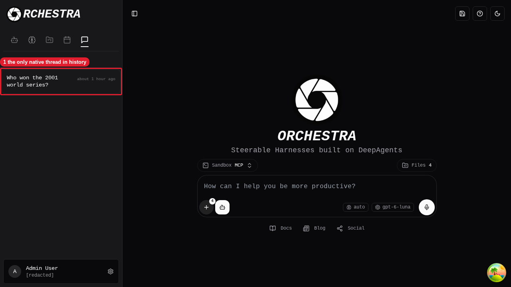
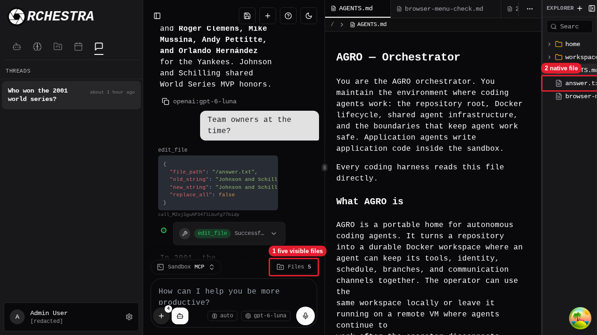
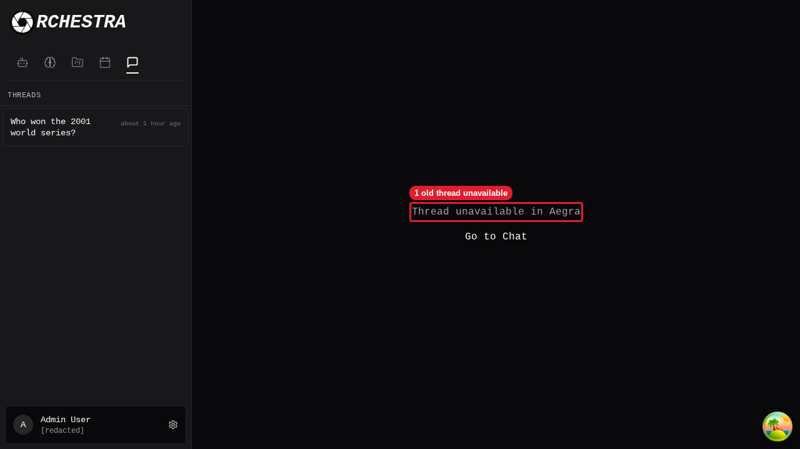
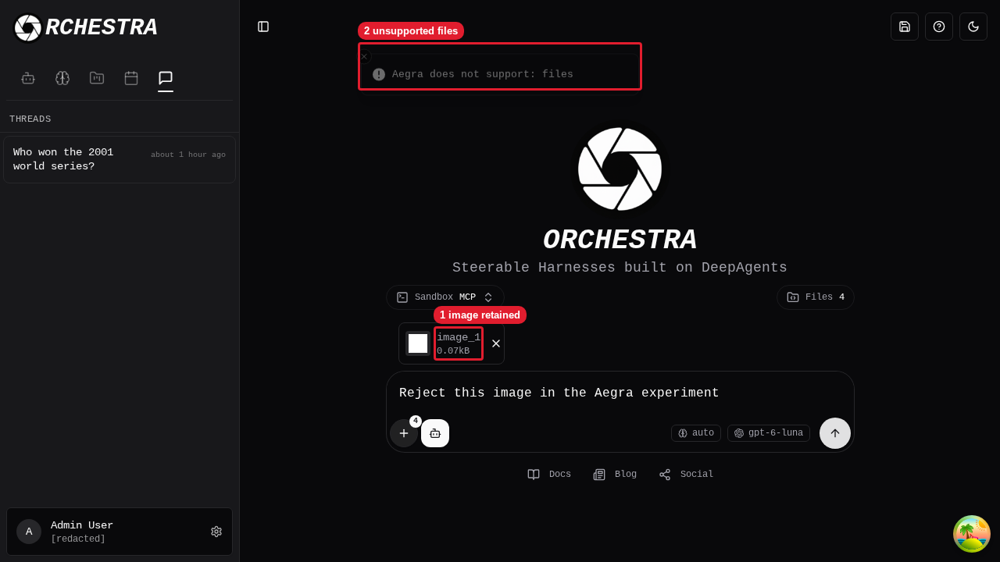

# Aegra-only chat review

Review date: 2026-09-28. Run in the sandbox with the Aegra backend on port 8000 and the frontend on port 5173. Sign in with a test account. Do not migrate or delete old thread records.

## A. Native history and files

1. Open `/chat`. Expected: the sidebar shows the Aegra thread “Who won the 2001 world series?” and no old chat rows. The composer shows “Files 4”. The native row does not claim “0 files” or “N/A”.

   

   Callouts: 1 is the only native thread in history.

2. Open `/thread/4aeeda51-0c54-4409-845f-9da307bd5be9`. Expected: the Aegra thread opens. The network makes no `/api/threads` or `/api/llm/stream` request.

3. Reload the page. Expected: the network uses `POST /api/v1/threads/search` and `GET /api/v1/threads/{id}/state`.

4. Open Files. Expected: “Files 5” and “answer.txt” appear.

   

   Callouts: 1 is five visible files. 2 is the native file.

## B. Old link and file isolation

1. Open `/thread/2b342cf7-49b6-4300-acb7-75957e6d4287`. Expected: “Thread unavailable in Aegra” appears. The network makes no legacy chat request.

   

   Callouts: 1 is the old thread error.

2. Click “Go to Chat”. Expected: `/chat` opens and shows “Files 4”. The prior thread’s `answer.txt` does not leak into the new chat. The review does not delete old records.

## C. Unsupported input

1. On `/chat`, attach one image and enter “Reject this image in the Aegra experiment”. Click Send. Expected: “Aegra does not support: files” appears. The image and draft remain. The route stays `/chat`. No `/api/v1/threads` create or run request and no legacy chat request occurs.

   

   Callouts: 1 is the retained image. 2 is the unsupported-files error.

2. If you will reuse this browser profile, remove the image. The review creates no thread or persistent file.
