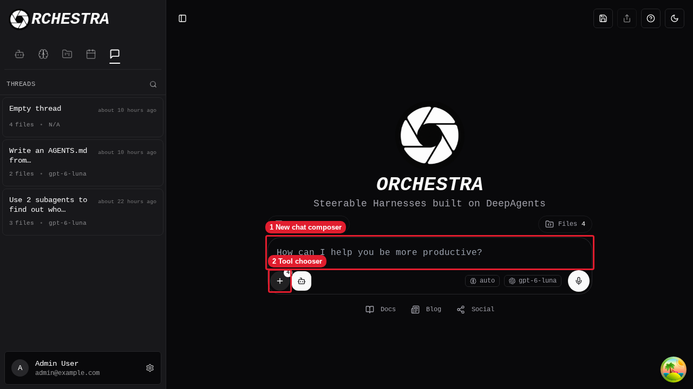
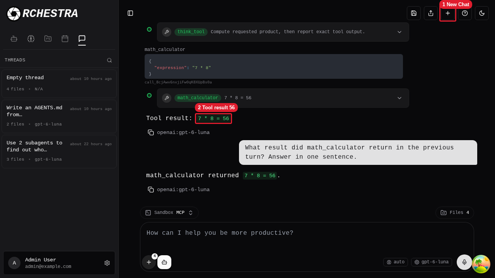

# Aegra new-thread manual review

The review ran locally in the existing Orchestra Herdr workspace. The pre-existing Orchestra backend used port `8000`, and the frontend used port `5173`. A task-owned Aegra service used port `2026` and its own disposable PostgreSQL database. Cleanup did not reconfigure or delete an existing database. This record does not include credentials or database URLs.

## UI journey

1. Sign in as the local Admin User. Open `http://127.0.0.1:5173/chat` and select New Chat. The composer is empty, and the account still shows `Files 4` from passive context. These files did not block a text message or enter the Aegra request.

   

   Callouts: 1 is the new chat composer. 2 is the Orchestra action selector.

2. Ask `math_calculator` to compute `7 * 8` and show the calculator result. The screenshot shows the exact prompt.

3. Select Send.

   Expected: The UI stays on `/chat`. It displays a `math_calculator` call with `{"expression":"7 * 8"}`, the result `7 * 8 = 56`, and a streamed final reply, `Tool result: 7 * 8 = 56`. Aegra logged a successful `POST /api/aegra/threads/5397299e-69bd-4a5a-9e5b-639511982204/runs/stream` with status `200` and run `183f8a2d-b4ca-4ca2-b088-91f0b70800fe`.

4. Enter `What result did math_calculator return in the previous turn? Answer in one sentence.` in the same `/chat` view.
5. Select Send.

   Expected: The reply says `math_calculator returned 7 * 8 = 56.` Aegra logged a second successful stream on the same thread with status `200` and run `22f34d90-53dc-490b-b951-99aaf119dec0`.

   

   Callouts: 1 is the New Chat action. 2 is the calculator result. The first reply and the second-turn exchange are visible below it.

## API and isolation checks

- An unauthenticated `POST http://127.0.0.1:5173/api/aegra/threads` with `{}` returned `401` through the frontend proxy. Direct unauthenticated create on port `2026` also returned `401`.
- The focused backend integration runner `bash backend/scripts/test-aegra-chat-stream.sh` passed all three tests. It uses two valid test identities. `backend/tests/integration/test_aegra_chat_stream.py` checks that the second identity cannot read the test thread or its state, read or attach to its run stream, or start a run on the first identity's thread. Each cross-user request returns `403` or `404`. It also checks that the first identity can attach to its own run. This is test-fixture evidence, not a second interactive login to the existing local account database.
- The same integration test checks that Aegra persists thread, run, and checkpoint state separately and adds no Orchestra thread row. It fails if the new-thread run calls Orchestra `stream_generator` or `LLMController.llm_stream`.

## Cleanup

The Aegra review service ran only in Herdr pane `w4:pB`. Its database name was `aegra_ui_61727680cbad486a96a386d2e89e06df`, as recorded in `/tmp/orchestra-aegra-ui-receipt.json`.

1. Read the foreground process in `herdr pane process-info --pane w4:pB`.
2. Send `SIGINT` only to the process running `/tmp/orchestra-aegra-ui-launch.py`. The pane returned to its shell. A connection to port `2026` then failed.
3. Read `/tmp/orchestra-aegra-ui-receipt.json`. Confirm container `postgres` and database name `aegra_ui_61727680cbad486a96a386d2e89e06df`.
4. In that container, run `psql -v ON_ERROR_STOP=1 -U "$POSTGRES_USER" -d postgres -c 'DROP DATABASE aegra_ui_61727680cbad486a96a386d2e89e06df WITH (FORCE)'`. The command printed `DROP DATABASE`. A read-only `pg_database` count for this exact name returned `0`.
5. Check `herdr pane process-info --pane w4:p1` and `herdr pane process-info --pane w4:p6`. The pre-existing backend and frontend processes remained running. Cleanup did not stop earlier-attempt panes or drop pre-existing databases.
